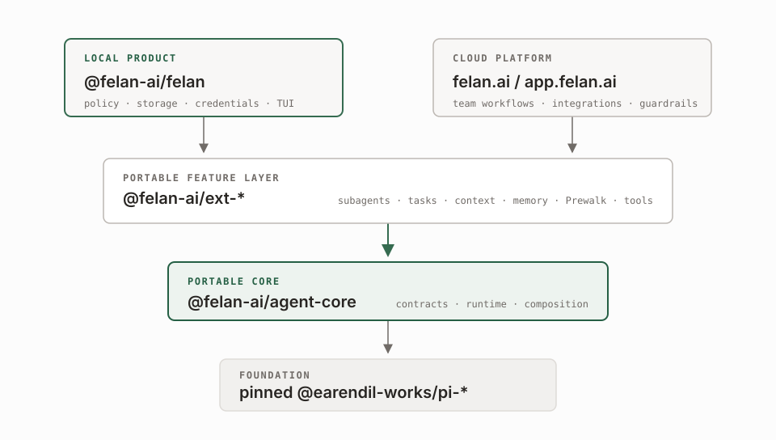

<h1 align="center">Felan</h1>

<p align="center">
  <strong>Get the job done. Waste less.</strong><br>
  An open-source, model-portable coding agent built for cost-efficient,
  verifiable software work.
</p>

<p align="center">
  <a href="https://www.npmjs.com/package/@felan-ai/felan"></a>
  <a href="https://github.com/felan-ai/felan/actions/workflows/ci.yml"></a>
  <a href="LICENSE"></a>
  <a href="https://nodejs.org"></a>
</p>

Felan is built around one rule: an optimization only counts when the task still
succeeds. It combines model routing, progressive context, compact tool output,
explicit task state, and estimated API-equivalent savings for supported
optimizations.

**Correctness first. Efficiency by design.**

> [!IMPORTANT]
> The local agent runs with your user's filesystem and process permissions. It
> is a host application, not a sandbox. Use an isolated host for untrusted
> projects or commands.

## Install and run

Felan supports Node.js 22.19.0 or newer. Run it without a global install:

```sh
npx @felan-ai/felan
```

Or install the `felan` command:

```sh
npm install --global @felan-ai/felan
felan
```

Connect a provider inside the TUI with `/login`, then start working:

```sh
felan "inspect this project and explain how to run its tests"
felan --continue
felan savings
felan --diagnostics
felan update
```

Initial messages start the interactive TUI by default. Use `--mode text` for a
one-shot final response or `--mode json` for Pi-compatible JSONL session events.
Both modes support `--continue` and exact `--provider`, `--model`, and
`--thinking` selection. A verified global npm installation also supports the finite
`felan update` command. See [Getting started](docs/getting-started.md) for
first-run setup and [Local CLI](docs/user-guide/local-cli.md) for all accepted
commands, flags, and local state.

## Efficient by design

Felan treats correctness as the constraint and cost as the optimization target.
Fewer tokens can support that goal, but they are not the outcome: a cheaper run
that fails is not an efficiency win.

| Boundary | What Felan does |
| --- | --- |
| **Model routing** | Prewalk can start a task with a stronger planner and continue the same conversation trajectory on a configured implementation model. |
| **Context control** | Progressive nested instructions, scoped subagents, lazy MCP discovery, and bounded research keep context focused on the current work. |
| **Tool output** | RTK-backed command rewriting and post-tool compaction reduce noisy model input while preserving failures, complete JSON, and recoverable output. |
| **Explicit state** | Dependency-aware tasks, structured questions, retained subagent records, and local project memory keep decisions and progress inspectable. |
| **Measurement** | `/savings`, `felan savings`, and the Powerline footer report estimated API-equivalent cost avoided by supported optimizations. |

Felan is developed against **cost per verified task**, not token count alone.
The public [harness-bench](https://github.com/felan-ai/harness-bench) project
holds the task, starting repository, verifier, timeout, and environment
equivalent when comparing configurations. Correctness is primary; cost, token
usage, and latency are supporting measurements. Read
[Efficient execution and savings](docs/concepts/efficient-execution.md) for the
measurement boundaries and claim limits.

## Local agent, portable core

`@felan-ai/felan` is the account-free local terminal agent. The Felan cloud
platform at [felan.ai](https://felan.ai) and
[app.felan.ai](https://app.felan.ai) composes the same portable core and
extensions as a managed host. Each host owns the boundaries that cannot be
portable:

| Local Felan | Felan cloud platform |
| --- | --- |
| Runs on your machine from `@felan-ai/felan` | Runs as managed background agents |
| Uses provider-owned local credentials; no Felan account required | Adds tenant/team workflows, integrations, visibility, and guardrails |
| Stores sessions and project memory under the local agent directory | Provides host-managed storage, credentials, and integrations |
| Applies a fixed source-controlled built-in and resource policy | Chooses the managed host's policy and integrations |

Read [Architecture](docs/concepts/architecture.md) for the ownership boundary
and [Local memory architecture](docs/concepts/local-memory.md) for the local
versus host-managed memory lifecycle.

## Built for software work

| Workflow | What Felan adds |
| --- | --- |
| **Delegate and inspect** | Tracked asynchronous subagents with bounded nesting, live transcripts, steering, continuation, cancellation, and completion notices. |
| **Plan and hand off** | A shared task graph with prerequisites, ownership, acceptance criteria, ready/blocked views, verified results, and same-session Prewalk model routing. |
| **Ask instead of guessing** | Searchable one-question and one-to-four-question wizards with multi-select, freeform answers, comments, and timeout handling. |
| **Load context where it applies** | Cwd instructions plus progressive nested `AGENTS.md`/`CLAUDE.md` discovery and explicit Agent Skills. |
| **Remember locally** | An account-free, project-scoped Markdown wiki with bounded evidence ingestion, validation, citations, and retryable host-owned publication. |
| **Retrieve web evidence** | Provider-backed URL discovery, bounded matching text/PDF passages, and explicit SSRF-untrusted remote content boundaries. |
| **Connect external tools carefully** | A lazy OAuth-only remote MCP gateway, explicit credential ownership, and bounded untrusted remote results. |
| **Use the right model tools** | GPT-specific structured command/patch/image tools, detached Background Bash for other providers, and RTK-backed command/output optimization. |
| **Inspect efficiency** | Session, project, and retained local estimates through `/savings`, `felan savings`, and the default Powerline footer. |
| **Keep the TUI readable** | Grouped tool activity, full-call inspection, agent/task/process overlays, and an ANSI-aware Powerline footer. |

The [extension catalog](docs/reference/extension-catalog.md) maps each workflow
to its package, host boundary, commands, and runtime conditions.

## Explicit host boundaries

Felan keeps the local host narrow in some places on purpose:

- only source-controlled built-in extensions are loaded;
- ambient Pi packages, extensions, prompts, themes, project settings, and
  package resources are filtered;
- model credentials and MCP OAuth tokens belong to the local host;
- web, document, browser, MCP, memory, and model-facing remote content are
  bounded and treated as untrusted; and
- missing binary dependencies degrade safely and require explicit interactive
  installation or disablement.

These controls do not sandbox ordinary shell or filesystem operations. Read the
[runtime and security guide](docs/concepts/runtime-and-security.md) before
using Felan with sensitive repositories.

## Architecture

<!-- Standalone source: docs/diagrams/felan-runtime-architecture.html -->
<picture>
  <source media="(prefers-color-scheme: dark)" srcset="docs/diagrams/felan-runtime-architecture-dark.svg">
  <source media="(prefers-color-scheme: light)" srcset="docs/diagrams/felan-runtime-architecture-light.svg">
  
</picture>

**Felan wraps [Pi](https://github.com/earendil-works/pi); it does not fork Pi.**
Pinned Pi packages provide the model, session, extension, and TUI primitives;
Felan owns the host contracts, feature behavior, policy, storage, and
presentation around them.

Behavior stays in its owning layer: `apps/tui` owns local policy, storage, and
presentation; `ext-*` packages own portable feature behavior; and Agent Core
owns adapter-neutral runtime contracts and base composition.

## Documentation

The [documentation hub](docs/README.md) routes readers by audience:

- [Getting started](docs/getting-started.md)
- [Local CLI](docs/user-guide/local-cli.md)
- [Configuration](docs/user-guide/configuration.md)
- [Commands and shortcuts](docs/user-guide/commands-and-shortcuts.md)
- [Agents, tasks, and Prewalk](docs/user-guide/agents-tasks-and-prewalk.md)
- [Context and memory](docs/user-guide/context-and-memory.md)
- [Web, MCP, browser, and documents](docs/user-guide/web-mcp-and-browser.md)
- [Efficient execution and savings](docs/concepts/efficient-execution.md)
- [Architecture](docs/concepts/architecture.md)
- [Runtime and security](docs/concepts/runtime-and-security.md)
- [Comparisons with Codex, OpenCode, Claude Code, Pi, and Oh My Pi](docs/comparisons/README.md)
- [Contributing](CONTRIBUTING.md)
- [Release process](docs/maintainers/releasing.md)

## Repository map

| Package | Purpose | Documentation |
| --- | --- | --- |
| [`@felan-ai/felan`](apps/tui/README.md) | Cost-efficient, model-portable local coding agent and `felan` binary | [Local CLI](docs/user-guide/local-cli.md) |
| [`@felan-ai/agent-core`](packages/agent-core/README.md) | Portable runtime contracts, prompt, tools, model tiers, and Pi composition | [Architecture](docs/concepts/architecture.md) |
| [`@felan-ai/ext-subagents`](packages/ext-subagents/README.md) | Tracked asynchronous subagent protocol | [Agents and tasks](docs/user-guide/agents-tasks-and-prewalk.md) |
| [`@felan-ai/ext-tasks`](packages/ext-tasks/README.md) | Dependency-aware root-session task graph | [Agents and tasks](docs/user-guide/agents-tasks-and-prewalk.md) |
| [`@felan-ai/ext-prewalk`](packages/ext-prewalk/README.md) | Same-session planner-to-implementation handoff | [Agents and tasks](docs/user-guide/agents-tasks-and-prewalk.md) |
| [`@felan-ai/ext-ask-user`](packages/ext-ask-user/README.md) | Structured one-to-four-question input | [Commands](docs/user-guide/commands-and-shortcuts.md) |
| [`@felan-ai/ext-context`](packages/ext-context/README.md) | Progressive nested project context | [Context and memory](docs/user-guide/context-and-memory.md) |
| [`@felan-ai/ext-context-view`](packages/ext-context-view/README.md) | Estimated context-window usage inspector | [Context and memory](docs/user-guide/context-and-memory.md) |
| [`@felan-ai/ext-insights`](packages/ext-insights/README.md) | Local session analytics reports | [Commands](docs/user-guide/commands-and-shortcuts.md) |
| [`@felan-ai/ext-prompt-history`](packages/ext-prompt-history/README.md) | TUI prompt-history picker | [Commands](docs/user-guide/commands-and-shortcuts.md) |
| [`@felan-ai/ext-memory`](packages/ext-memory/README.md) | Portable local-first memory contracts | [Memory architecture](docs/concepts/local-memory.md) |
| [`@felan-ai/ext-output-style`](packages/ext-output-style/README.md) | Validated concise, explanatory, and custom response instructions | [Configuration](docs/user-guide/configuration.md#output-style) |
| [`@felan-ai/ext-web-access`](packages/ext-web-access/README.md) | Bounded web discovery and matching text/PDF passages | [Web access](docs/user-guide/web-mcp-and-browser.md) |
| [`@felan-ai/ext-mcp`](packages/ext-mcp/README.md) | Portable OAuth-only remote MCP gateway | [MCP](docs/user-guide/web-mcp-and-browser.md) |
| [`@felan-ai/ext-felan-api`](packages/ext-felan-api/README.md) | Single authenticated Felan API gateway | [Configuration](docs/user-guide/configuration.md#felan-api) |
| [`@felan-ai/ext-browser`](packages/ext-browser/README.md) | Reviewed `agent-browser` CLI integration | [Browser](docs/user-guide/web-mcp-and-browser.md) |
| [`@felan-ai/ext-markitdown`](packages/ext-markitdown/README.md) | Bounded office-document conversion | [Documents](docs/user-guide/web-mcp-and-browser.md) |
| [`@felan-ai/ext-background-bash`](packages/ext-background-bash/README.md) | Detached Bash processes and logs | [Commands](docs/user-guide/commands-and-shortcuts.md) |
| [`@felan-ai/ext-codex`](packages/ext-codex/README.md) | GPT-specific structured tools and request controls | [Configuration](docs/user-guide/configuration.md) |
| [`@felan-ai/ext-rtk-optimizer`](packages/ext-rtk-optimizer/README.md) | RTK command rewriting and output compaction | [Runtime dependencies](docs/reference/runtime-dependencies.md) |
| [`@felan-ai/ext-codebase-memory`](packages/ext-codebase-memory/README.md) | Structural code search, symbol reads, and bounded grep augmentation | [Runtime dependencies](docs/reference/runtime-dependencies.md) |
| [`@felan-ai/ext-powerline`](packages/ext-powerline/README.md) | ANSI-aware local TUI footer | [Local CLI](docs/user-guide/local-cli.md) |

## Develop from source

Repository development and CI use Node.js 22.20.0 and pnpm 9.15.5:

```sh
git clone https://github.com/felan-ai/felan.git
cd felan
corepack enable
pnpm install --frozen-lockfile
pnpm build
node apps/tui/dist/cli.js
```

Run the complete build, type-check, test, license, packaging, and packed
installation suite with:

```sh
pnpm verify
```

To review the Felan Pi themes in a browser, run `pnpm theme:preview` and open
`http://127.0.0.1:4173`. Use `pnpm theme:preview:check` for a no-write
validation or `pnpm theme:preview:build` to generate the ignored local artifact
at `.artifacts/theme-preview/index.html`. The preview is a visual review aid;
the Pi TUI remains the runtime source of truth.

See [Contributing](CONTRIBUTING.md) and the
[maintainer architecture map](docs/maintainers/architecture-map.md) before
changing a shared runtime or public package.

## Community and license

[Join the Felan Discord community](https://discord.gg/skNd4GSzZ) to connect with
users and contributors.

Felan is licensed under the [MIT License](LICENSE). See [NOTICE](NOTICE) for
third-party attribution and immutable upstream review details.
